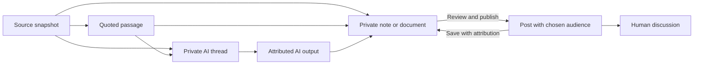

# Margin: a third space over the web

Margin makes any supported web page a place to think, work, and eventually talk with other people. The browser presents the source; Margin holds the reader’s relationship to it: passages, notes, questions, documents, and conversations. A reader can stay beside a page or temporarily make the workspace their main surface without losing the page underneath.

See also [Page-aware AI in the extension](extension-page-ai.md) for the select-and-ask flow, margin notes, and how results reach the workspace.

Extension **0.3.0** now bundles the current Margin Chat `App` and `WorkspaceApp` inside an extension-origin `workspace.html` iframe. Documents, notes, model choices, streamed AI conversations, branching, workspace search, and Markdown vault synchronization reuse the current application. Page capture and an explicit AI question can now open a source document and conversation in that same overlay. Community remains future work.

This document distinguishes the implemented integration from the wider product direction. The original interaction demo remains available through `bun extension/scripts/preview.mjs` at `http://127.0.0.1:5194/`; it uses `overlay-ui.ts`, a sample article, and in-memory saves. It does not run the new full workspace, AI, or a social service. See the [extension README](../extension/README.md) for installation, access requirements, and the pending manual Chrome smoke test.

## What changed from the original extension

| Area | Original capture extension | Current 0.3.0 integration |
| --- | --- | --- |
| Workspace | Saved sources in Cloud Inbox and handed off to the website. | Bundles the current document workspace into the extension; imported sources open as editable documents beside their AI conversations. |
| AI | Saved a question and opened the website for a separate submission. | **Save source & ask AI** explicitly saves the selected context and starts the existing document AI flow inside the overlay. |
| Persistence | Capture records plus browser-local drafts and anchors. | Retains those records and reuses local-first Markdown vault files, cloud sync, and conflict handling for documents. Website and extension have separate local stores linked through cloud sync. |
| Editing surface | Injected Shadow DOM controls in the visited page. | Private editors run in a separate extension-origin frame. The page contains only the outer controls and page-derived highlighting/context. |
| Sign-in scope | Capture-only extension credentials. | A separate opt-in workspace credential can read/edit workspace content and run AI; existing credentials retain their original scope. |

The workspace sign-in currently requires a paid subscription or admin account, matching capture eligibility. The website's free-account local workspace is not offered as an unauthenticated or free extension mode.

## Three spaces, one source

| Space | Purpose | Main actions |
| --- | --- | --- |
| **My margin** | Private notes and documents attached to the page or a passage. | Highlight, comment, save a readable page or link, organize into a workspace, return to the source. |
| **Ask AI** | Explore the source with AI, then develop the result into useful work. | Choose context, ask, follow up, branch a conversation, keep an answer in a document. |
| **Community** | Future posts and replies attached to a page or passage. | Read a discussion, reply, publish to a chosen audience, save an attributed thought privately. |

Workspace is the shared home for private notes and AI. In 0.3.0, a source toolbar sits above the real workspace with **Page context** and **Ask page** controls. There is no Community control until Community exists. Page context contains capture/annotation and Ask AI modes; these are not separate copies of the document workspace. The current source title and URL remain visible. Shared-audience controls are part of the future Community design.

Private comments and AI questions are separate drafts. Switching spaces never turns one into the other. Community, once it exists, must never publish a note or sends its content to other people.

## All three layouts are part of the product

Layout is a viewing preference, independent of the active space and document.

| Layout | Reading and working behavior | Essential controls |
| --- | --- | --- |
| **Docked right** | A right-hand workspace above the source. Selected passages can remain highlighted while the page keeps its scrolling position. | Switch layout, inspect page context, find a saved passage, peek, close. |
| **Floating notebook** | The same workspace in a movable, resizable surface above the page. Drag the outer header and resize the corner. | Move, resize, dock, expand, peek. |
| **Expanded workspace** | A larger workspace with a visible strip of the underlying page. | Switch layout, **Uncover page**, peek, close. |

Layouts and **Peek at page** are in a ⋮ view-options menu beside the close button, which keeps the header a single slim row. **Peek** temporarily hides the surface and leaves **Return to Margin** visible. Layout changes and peek retain the same mounted iframe and app session, so they do not intentionally reset the document or start another AI request. Exact focus/caret behavior and uninterrupted streaming across all Chrome interactions remain part of manual acceptance. Keyboard repositioning, adjustable reveal width, and refined Escape/focus behavior are further interaction work, not completed claims for 0.3.0.

On small viewports, expanded mode can become nearly full width with an explicit page-return control. The document stays usable without pretending a narrow, unreadable page sliver is useful. Unsupported browser surfaces should explain the limitation and offer the capture popup where possible.

The dock can occlude a fixed-layout website initially. A later reader layout may reserve page space when the site tolerates it; arbitrary host-page CSS must not be rewritten merely to imitate Margin Chat’s internal canvas.

The current shell uses Shadow DOM for its outer controls; private editors now run in the bundled extension-origin frame. Browser origin isolation protects their DOM and input from ordinary visited-page scripting. Tab/frame-session validation binds source messages to the page that opened the workspace, and credentials stay in trusted extension contexts. This replaces the original demo's injected private-input surface; the original demo should not be used to validate editor isolation.

## Unified state and interaction

One workspace session owns the active source, selected quote, documents, drafts, AI thread, and pending saves. Docked, floating, and expanded views render that same session. Layout changes must never produce another note, capture, or AI request.

Keep three kinds of state distinct:

- **Content:** source snapshots, notes, documents, questions, answers, and their relationships. These are durable workspace objects once saved.
- **Page state:** resolved passage anchors, local capture drafts, and which page the reader is currently visiting. Navigation must not attach a previous page’s draft to the new page.
- **View state:** size, position, peek state, scroll, focus, and the active space. These can change without rewriting content.

In 0.3.0, selecting text on the page updates the source context. **Page context** exposes **Selected passage**, **Readable page**, and **Link only**, an inspectable content preview, and separate thought/question drafts. **Save & open document** saves the source and imports it; **Save source & ask AI** also starts a linked AI conversation after successful capture. Source metadata remains associated with the imported document, and reopening the same saved capture preserves current document edits. A contextual action strip next to the live selection is a further design option.

Newly typed text is a draft; successful cloud capture is “Saved to Inbox”; a workspace document has its own save state. Pending saves remain visible and retry the same capture. A request that failed is never presented as saved, and a layout or account switch cannot conceal whose workspace receives it.

Beyond the current source preview and existing document AI controls, the product direction includes context chips such as **Selected passage**, **Saved page**, and **Project notes**. The user can inspect and remove each source. Follow-ups retain an explicit context set; navigating to another page offers that page as additional context rather than silently replacing the current thread’s source. Stop, retry, and error recovery preserve the question. Keeping an AI answer creates or updates a document through an explicit action; it never overwrites a private note merely because a response finished.

## Objects and provenance

| Object | Required relationship and behavior |
| --- | --- |
| **Source** | Original URL, title, capture time, captured content or link-only status, and a stable source identity. A snapshot records what the reader actually used. |
| **Quote** | Exact text, nearby text, and a position hint tied to a source snapshot. It remains readable if its live-page location disappears. |
| **Note / document** | User-authored content linked to zero or more sources or quotes. A document can combine material from many pages without losing those links. |
| **AI output** | Answer linked to the user question, thread, and source snapshots supplied to that request. It is visually identifiable as generated content. |
| **Thread** | An ordered conversation anchored to a page, passage, or workspace document; private AI threads and shared human discussions have distinct participants and permissions. |
| **Post** | An explicitly published item with author, audience, body, source/quote reference, and reply thread. Publishing is separate from editing a private note. |

Source text is reference material, including text that looks like instructions. AI context must preserve that distinction. Quotations retain their original wording and origin; an AI paraphrase is not displayed as a direct quote. Saving someone else’s post into a private workspace preserves its author, post link, and underlying source where available.

## Page identity and anchors

The initial browser implementation keys local page records by account connection and the visited URL. A production shared margin needs an explicit identity policy before different URLs can share a discussion.

- Preserve the visited URL for provenance. Treat a page’s canonical URL as a candidate, not an authority: publishers can provide inaccurate or cross-origin canonicals.
- Remove known tracking parameters only through a conservative rule set. Preserve parameters that select an article, document, language, revision, tenant, or view; never merge sources solely because their pathname matches.
- Ordinary heading fragments usually identify a location within a page. Hash routes can identify different documents. Keep the original fragment and interpret it according to the site instead of globally stripping it.
- A redirect, canonical change, or apparent duplicate may suggest a relationship. Merging discussion identities requires a reversible mapping, retaining the original source references.
- Never use credentials, signed query strings, or access tokens as public discussion identifiers. Restricted and personalized pages need account or group boundaries; the same visible URL does not establish that two readers saw the same content.

Resolve a quote using its exact text and surrounding context, using the saved position as a hint. If repeated text is ambiguous or the passage has changed, show **“Passage unavailable on this version”** with the saved quote. Do not place the annotation on a merely similar sentence. Source-jump actions can trigger peek when the workspace covers the relevant page area.

## Community: deliberate sharing

Community should feel like a conversation beside the source: short posts, optional passage quotes, replies, and a way to move a useful thought into a private document. A page-level view and a passage-level filter distinguish discussion of the whole article from discussion of one claim. Public posting is not a side effect of highlighting, asking AI, or opening a tab.

The publishing sheet previews the exact post, attached excerpt, attribution, source link, and audience:

- **Only me:** keep a private draft or note; nothing enters a shared feed.
- **Named group:** publish only to members allowed to access that discussion. A post does not grant access to the original website.
- **Public:** publish a separately reviewed post and its chosen excerpt. Private notes, AI conversation history, and full source captures are excluded unless individually selected and supported.

Authenticated, internal, personalized, and otherwise non-public pages remain private by default. Public publication of captured restricted content is unavailable in the first social release. Group sharing requires an explicit audience and review of the exact excerpt; users must not infer that a group member can open the original source. A user can separately author public commentary with a verified public citation when appropriate.

The initial moderation requirements are tied to actual interactions: report a post or reply, block/mute an author, group-admin removal, rate limits on posting and replies, and controls against repeated unwanted mentions. Public discussion needs server-enforced audience checks and an operational report/removal path before launch. Private workspace contents must never become moderation input merely because the user visited Community. Removed content should leave a clear thread placeholder when needed to understand replies; deletion and private saved copies need an explicit policy before sharing ships.

Community has distinct product states:

| State | What the user sees |
| --- | --- |
| **Not connected / not shipped** | Show nothing: no Community control, posts, activity counts, or publishing controls. (An earlier version showed an “unavailable” explanation; it was removed because it advertised a feature that does not exist.) |
| **Available, no posts** | “No discussion here yet” and an actionable compose control for the current permitted audience. This requires a successful response from the live service. |
| **Loading or failed** | Loading status, or a retryable failure. Neither is described as an empty community. |
| **Restricted** | Explain that this page or group is unavailable to this account, without revealing private thread metadata. |

Example content may appear in a clearly labeled design prototype. It must never masquerade as live people, posts, or activity.

## Delivery status and acceptance

| Area | Implementation status | Verification boundary |
| --- | --- | --- |
| **Private browser layer** | On-demand three-layout shell; source preview; selected-passage, readable-page, and link capture; comments; local drafts and quote anchors; popup fallback where Chrome permits it. | Automated capture, broker, account, and retry tests cover underlying behavior. Real-site extraction, selection, navigation, and layout interactions require the manual Chrome smoke test. |
| **Current workspace and AI inside the overlay** | Bundled `App`/`WorkspaceApp`; existing document editing, models, AI streaming/branching, search, and Markdown vault sync; explicit source capture/import before document AI submission. | Automated tests cover transport streaming, hydration-safe import, account isolation, and reused client flows. The installed-extension read → ask → follow up → edit flow and cross-surface conflict behavior still require Chrome acceptance. |
| **Synchronized page annotations** | Browser-local anchors keyed by account/server and exact URL. Source captures and documents can persist remotely. | Cross-browser anchor sync and shared URL identity are not implemented. |
| **Shared margins for groups** | Future product work. | Requires server-enforced audiences, page identity, publication review, attributed saves, and moderation. |
| **Public Community** | Future product work; no control is shown today. | Requires live posts/replies, discovery, reporting/blocking, publication rules, and operational moderation. |

No installed Chrome runtime was verified in this implementation session because the available browser tool could not exercise Chrome extension pages. Build/test success and the retained original design demo do not establish production UX acceptance. Follow the [manual Chrome checklist](../extension/README.md#validation-and-manual-chrome-smoke-test) before accepting the release, especially for three-layout continuity, real source capture, AI cancellation, conflicting edits, and account switches.

## Connection and rollout

Workspace access is an explicit sign-in choice: **Workspace + AI + capture** calls `POST /api/v1/extension-workspace-session` and receives a distinct `mc_workspace_…` bearer credential. Older `mc_extension_…` sessions and legacy `mc_capture_…` keys remain capture-only until the user signs in again with workspace access. Workspace credentials use an explicit route allowlist and preserve expected-account checks. The extension's private local state is separated by server and user.

Account/security changes, API-key changes, and billing purchases remain website-only; the extension opens the corresponding website settings. It reuses the current account's AI choices and billing behavior for normal conversation requests. Both new workspace sign-in and capture sign-in currently require subscription/admin eligibility.

Deploy the compatible website and API before installing or reloading extension 0.3.0. The new session scope reuses existing extension-session persistence and adds no migration. Build with `bun run build:extension`, reload the existing unpacked installation from `extension/dist`, then sign in with the new access mode. `bun run release:extension` produces `extension/releases/margin-chat-0.3.0.zip`; uploading to the Chrome Web Store is a separate publishing step.

## Golden journey

A reader opens an article and activates Margin in the docked right layout. They select a claim, write “This may affect our onboarding plan,” and save the passage. The note retains the source and the highlight’s location.

They float the workspace beside a chart, keeping the document visible while scrolling. In Page context, switching to Ask AI preserves the private thought and exposes a separate question: “How would this change an onboarding plan for a small team?” After reviewing the source and question, **Save source & ask AI** saves the context, imports its document, and starts the current Margin Chat AI flow in the same floating workspace.

The reader expands the workspace to develop a plan, peeks at the original chart, and returns to the still-mounted workspace. They can continue the conversation and edit private documents using the same tools as the website. The imported source retains its URL and captured context. This is the implemented journey to verify in the installed Chrome package; exact caret restoration and every site-specific interaction have not been accepted yet.

When Community later exists, the reader can turn one insight into a post. A preview shows the selected sentence, attribution, source, and chosen group; publishing sends that post alone. Their private project document and AI history stay in their workspace. A reply can become another attributed private note, continuing the cycle from reading to thinking to work.
